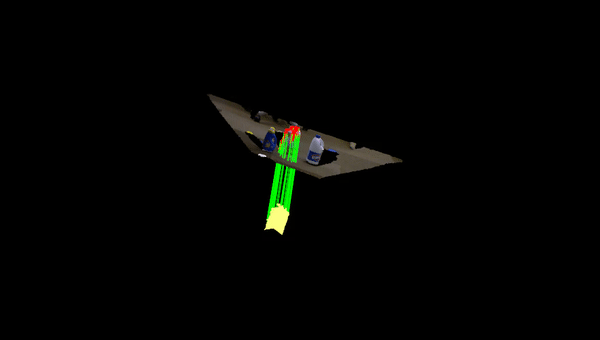

**University of Pennsylvania, CIS 565: GPU Programming and Architecture, Final Project**

CUDA Based 3D-Descriptor for Object Detection 

* Yu Sun
* [LinkedIn](https://www.linkedin.com/in/yusun3/)
* Tested on: Ubuntu 16.04 , i7-6700HQ CPU @ 2.60GHz × 8 , GeForce GTX 960M/PCIe/SSE2, 7.7GB Memory 
* Dependency: Boost 1.58, Eigen 3.3.4, FLANN, PCL 1.9.0, CMake 3.13.0

## Introduction

Features are critical in many computer vision problems. In 2D image space, there exist numerous algorithms such as SIFT, SURF and HOG. The techniques are pretty sophisicated and well developped. Almost all students learning computer vision have written his or her own version of some sort of 2D feature algorithm. However, nowadays the focus seems to gradually shift to 3D world. Therefore, I think that'd be cool to do something I have never done before: to have some fun with object detection in 3D space. 

For point clouds, there exists the famous library PCL. I refer to original papers and their implementations and use their implementations as a baseline to test performance and correctness. 

Below is a sample demo for detection of a milk cartoon in a rather simple scene. The demo used SHOT Descriptor with only geometric information. 


Regardless of what descriptors/features exactly to use for object detection. There are some common steps during the process:

* Downsampling of Point Clouds (Optional) 
* Computation of Normals and Reference Frame
* Descritptor Computation
* Correspondance Matching 

Among these steps, search (usually either radius search or nearest neighbor) is extremely frequently used. Therefore, I have spent a fair amount of time implementing those algorithms in CUDA as well, and I will explain them in more details later. 

## Algorithms

### Downsampling
Downsampling of point clouds can be used to save computation and memory. Some descriptors like SHOT use a subsample of original point cloud as features to compute local reference frame and descriptors.

The downsampling basically takes a user chosen radius and split the whole point cloud into grids based on the radius, and only keep the point closest to the center of the grid center. The larger the radius, the less points will be kept. Invalid radius leading to the point cloud spliting into total number of grids greater than the point cloud size is not allowed. 

### Radius Search
Radius search is often used when obtaining geometric information from the point cloud. Computation of reference frame, normals, eigen vectors, etc. need neighbor search within certain radius. PCL uses FLANN KDTree based radius search, while I just implemented a CUDA brute force version of radius search. I'll update to a coherent version if time permitted. 

### Nearest Neighbor
Since different descriptors usually keep various length of data, a brute force version of nearest neighbor search doesn't seem very efficient. Therefore, I implemented a template version of Kdtree search with user defined data dimensions. To be able to find the correspondence more efficiently and display using pcl's function, every node of the tree keeps track of original indice of data within the vector. 


```
Code Layout

- src (core of detection)
   - detection.cu (detection pipeline)
   - grid.cu (point cloud common property calculation)
   - sample.cu (downsamling)
   - search.cu (kdtree correspondence searching)
   - shot.cu (shot descriptor and brute force radius search)
   - shot_lrf.cu (shot local reference frame and brute force radius search)
- pcd (point cloud files)
- util (file parsing)
- main.cpp (main function)

(Continuing work ....)

```

## Performance Analysis 

TO BE ADDED

## Issues
I didn't write a CUDA version of everything. Time is of course a constraint. However, many other reasons exist. For example, some functions just run faster on CPU due to the GPU memory copy/allocation overhead and/or need of atomic functions.

For local reference calculation, I couldn't get eigenvectors and eigenvalues calculation done in kernel. Therefore, I set a fixed maximum number of neighbors to search for Radius Search, and do the eigenvector calculations in cpu.

## Citation

PCL

TO BE ADDED